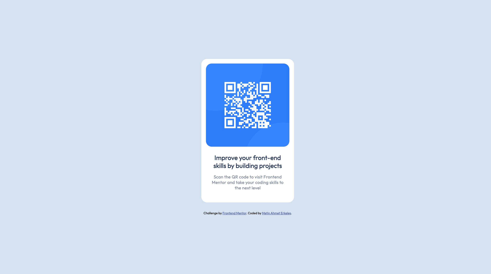

# Frontend Mentor - QR code component solution

This is a solution to the [QR code component challenge on Frontend Mentor](https://www.frontendmentor.io/challenges/qr-code-component-iux_sIO_H). Frontend Mentor challenges help you improve your coding skills by building realistic projects.

## Overview

### Screenshot

### Links

- Solution URL: [https://github.com/metinahmeterkeles/QR-Code-Component]
- Live Site URL: (https://qr-code-component-mu-flame.vercel.app/)

## Author

- Website - [Metin Ahmet Erkeleş]
- Frontend Mentor - [@metinahmeterkeles](https://www.frontendmentor.io/profile/metinahmeterkeles)
